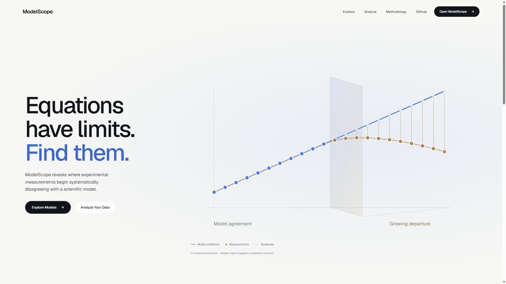
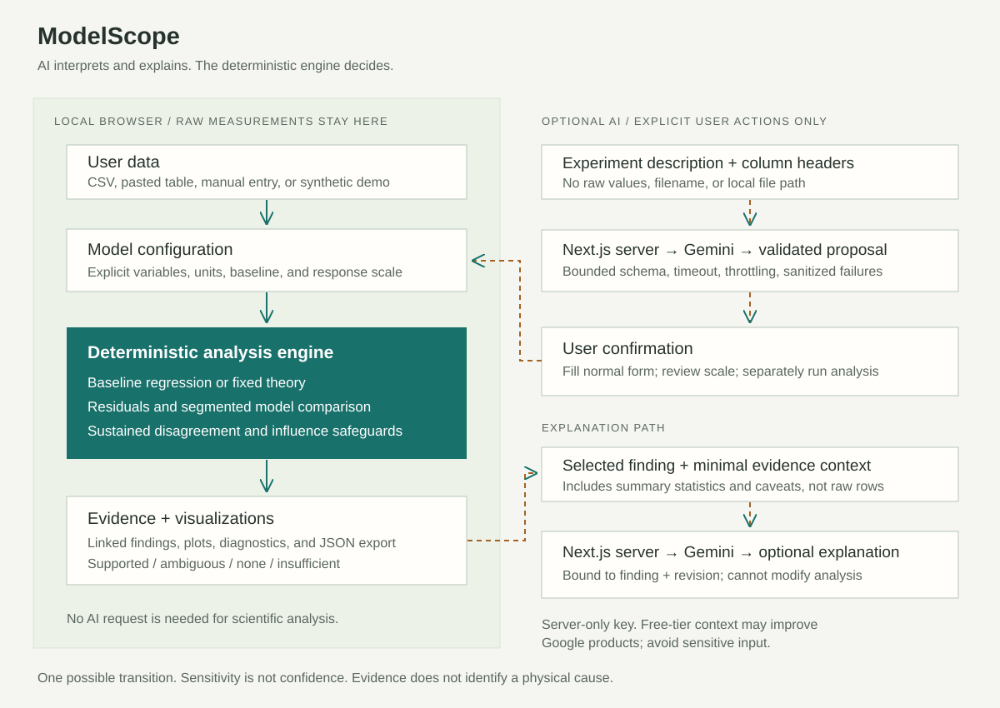

# ModelScope

**Equations have limits. Find them.**

Compare experimental measurements with a scientific model and inspect where disagreement becomes systematic.

**PUBLIC DEMO:** [modelscope-ten.vercel.app](https://modelscope-ten.vercel.app/)

**DEMO VIDEO:** Public video URL pending upload. The [2:45 production recording and captions](docs/submission/video/README.md) are prepared locally.



## The problem

Students often learn equations without understanding the assumptions and regimes in which those models apply. A good fit statistic can conceal structured disagreement. Science learning needs a way to connect model assumptions to inspectable observations.

## The solution

ModelScope is a local scientific workspace for evaluating model adequacy. Configure a baseline, run deterministic analysis, inspect residuals and comparisons, and trace findings back to their measurements. Evidence distinguishes supported, ambiguous, no clear transition, and insufficient outcomes. Model inadequacy does not establish a physical cause.

## Demo

[Open ModelScope](https://modelscope-ten.vercel.app) runs publicly on Vercel's free Hobby tier. Desktop/mobile flows and one live request per Gemini assistance route were verified on October 6, 2026. [Public source code](https://github.com/luiscontrerasus-glitch/ModelScope) preserves the complete development history. See the [production deployment verification](docs/deployment/README.md) and [earlier release record](docs/release-verification.md).

For a fast demonstration, keep Spring's progressive-departure dataset and click **Run analysis**. Compare the main graph with its reference, inspect Residuals, Model comparison and Evidence, and open **View full evidence** for detailed findings. **Open data** reveals the measurements editor and experiment selection; **Import** opens custom data setup. [Recording script and exact shot list](docs/demo-video.md).

## Key capabilities

- Four scientific demonstrations across mechanics, physics approximation, chemistry, and engineering instrumentation.
- Custom CSV, pasted CSV/TSV, and manual measurements with explicit mappings and assumptions.
- Deterministic baseline/segmented comparison, sustained residual gate, and influence safeguard.
- Linked response/residual plots, measurement table, findings, and numerical evidence.
- Supported, ambiguous, none, and insufficient evidence; careful sensitivity-range semantics.
- Provenance-preserving JSON evidence exports and edit/rerun invalidation.
- Optional reviewed AI setup proposals and explanations of existing evidence; manual analysis works without a key.

## How it works



Pure TypeScript functions separate fitting and prediction from candidate search, comparison, residuals, and diagnostics. Typed experiment definitions provide models, units, questions, parameters, assumptions, and synthetic generators. React displays calculated evidence; it does not invent findings. CSV parsing, numerical analysis, plotting, and exports run in browser memory.

Optional Next.js Node routes mediate Gemini calls. Setup receives a description and headers, returns a validated proposal, and requires confirmation into the normal configuration. Explanation receives minimal context from a selected deterministic finding and returns separately labeled prose bound to its ID and analysis revision.

## Responsible AI

**AI interprets and explains. ModelScope's deterministic engine decides.**

AI cannot determine fits, residuals, transitions, sensitivity ranges, support states, or uncertainty. Setup is restricted to existing model families, literal source-backed units, and exact headers. Confirmation never runs analysis or supplies a response scale. Explanations are optional prose, visibly separated from **DETECTED BY MODELSCOPE**, and excluded from reproducible exports. Edits, reruns, and switching discard stale AI output.

The server uses strict schemas, semantic validation, 16 KB request bounds, a 15-second provider timeout, output limits, process-local throttling, and sanitized failures. Free-text validation reduces errors but cannot guarantee perfect interpretation or prompt-injection immunity.

Default: `gemini-3.5-flash-lite` via `@google/genai` 2.27.0. Its [structured-output capability](https://ai.google.dev/gemini-api/docs/models/gemini-3.5-flash-lite) and [standard text free tier](https://ai.google.dev/gemini-api/docs/pricing) were checked October 4, 2026. **Both live Gemini routes passed in production on October 6.** The recording pass also verified graceful temporary failure and a successful explanation retry. Mocks remain test evidence only. [Production verification](docs/deployment/README.md) · [AI design, exact sharing, and setup](docs/ai.md).

## Scientific methodology

The configured baseline is compared with a continuous hinge alternative on the same complete observations. A dimensionless penalized criterion accounts for fitted parameters and candidate search. Support requires improvement of at least 10, four consecutive same-sign deviations beyond twice the early residual scale, and retained support after diagnostic omission of the largest absolute baseline residual with the same deviation direction. Reported fits retain all observations.

Transition search requires 14 measurements and at least six at/below and six above a candidate. Only supported results have a transition sensitivity range. It includes near-best tested knees and neighboring measurements for sampling resolution; **it is not a confidence interval**. High R² and no detected transition do not establish physical correctness. [Exact methodology, formulas, and limits](docs/methodology.md).

## Built-in experiments

| Demonstration | Baseline | Input → response |
| --- | --- | --- |
| Spring — Hooke's Law | F = kx; optional fitted offset | Extension / m → force / N |
| Pendulum — Small-Angle Approximation | T₀ = 2π√(L/g), fixed L = 1 m and g = 9.80665 m/s² | Initial angle / degrees → period / s |
| Beer–Lambert — Concentration Response | A = mc + b, fitted offset by default | Concentration / mmol/L → dimensionless absorbance |
| Sensor Calibration — Linear Range | V = mQ + b, fitted offset by default | Reference force / N → output / V |

All examples and controls are explicitly **synthetic educational datasets**, not laboratory validation. Pendulum theory stays fixed instead of being fitted to the observed periods. [Questions, generators, assumptions, and experiment notes](docs/experiments.md).

## Custom data

Choose **Analyze your data**. Upload a local CSV with headers, paste CSV/TSV, or enter measurements manually. Inspect source records, map X/Y, declare names/units, and select Y = mX + b, Y = mX, or user-supplied fixed Y = C. Enter a positive response scale justified by prior knowledge, resolution, or an explicit tolerance. If unknown, investigate; no uncertainty is silently estimated.

Unknown units remain unspecified and differ from a unitless quantity. Labels never convert numbers. Blank records require explicit exclusion; meaningful records are never silently discarded. Original values/order and stable IDs are preserved. Edits pause evidence until a valid rerun. A synthetic temperature-response CSV is supplied for practice. [Formats, validation, limits, and export provenance](docs/custom-data.md).

## Privacy

Raw measurements remain in the browser. Optional setup sends only your experiment description and dataset headers. Explanation sends the selected deterministic finding and minimal model/evidence context, including summary statistics and caveats. It does not send raw rows, filenames, local paths, or the complete analysis. Summary statistics can still reveal information about measurements.

Gemini free-tier inputs may be used to improve Google products under its [current data-handling terms and pricing](https://ai.google.dev/gemini-api/docs/pricing). Avoid sensitive descriptions, labels, and evidence context. No accounts, database, or server-side dataset persistence are used. The key is server-only and never `NEXT_PUBLIC_`.

## Tech stack

Next.js App Router, React, strict TypeScript, authored CSS through Tailwind's pipeline, Three.js with React Three Fiber/Drei, Geist, Recharts, Zod, Papa Parse, and the official Google GenAI SDK. Vitest, Testing Library, and jsdom are development tools. Verified with Node 24.14.1.

## Running locally

```sh
npm ci
npm run dev
```

Open http://localhost:3000. AI is optional. To enable it, privately configure ignored `.env.local` using `.env.example`: `GEMINI_API_KEY`, `GEMINI_MODEL=gemini-3.5-flash-lite`, and `GEMINI_FREE_TIER_CONFIRMED=true` only after verifying an unbilled project. Do not enable billing or add a card. [Provider configuration](docs/ai.md#provider-and-free-tier-configuration).

Production preview:

```sh
npm run build
npm run start -- --hostname 127.0.0.1 --port 3000
```

Stop an existing production server before rebuilding and restart it afterward.

## Tests

```sh
npm test
npm run typecheck
npm run lint
npm run build
npm audit --omit=dev
```

**306 tests across 10 files** pass, including frozen Hooke numerical snapshots, the four experiments, custom provenance/validation, adversarial analysis inputs, and AI server/client contracts. Normal tests never call Gemini. Typecheck, lint, and production build pass before and after the redesign merge. The production audit reports zero vulnerabilities. Earlier development-only advisories are documented in the historical release record without a forced breaking upgrade. [Redesign release verification](docs/redesign/RELEASE.md), [earlier release verification](docs/release-verification.md), [historical milestone verification](docs/verification.md), [file inventory](docs/files.md).

## Limitations

Four built-in families and three custom baselines, one possible hinge, ordinary least squares, fixed theoretical parameters, assumed response scales, no calibrated false-positive rate, no confidence intervals or inferred mechanism. Measurement-input uncertainty, heteroscedastic weighting, and repeated independent-variable values are unsupported. A hinge can lag smooth departure; the influence check can withhold genuine support. Reload resets in-memory edits; export provides a record. Arbitrary equations, XLSX/PDF, persistence, and collaboration are outside this prototype. Public AI throttling is process-local, not distributed.

## Hackathon development

**Luis Contreras** started ModelScope from scratch during the overlapping ImpactHack 2026 and ForgeHacks Online 2026 build period. Full incremental Git history begins October 4, 2026; it has not been squashed, rewritten, or backdated. Codex assisted development, debugging, research, documentation, and verification. Open-source libraries and pre-trained Gemini are disclosed above.

ImpactHack's [official window](https://impacthack26.devpost.com/details/dates) runs October 1 at midnight PDT through October 7 at 11:45 PM PDT. Forge's intended track is **AI + Education**; use its [live Devpost deadline](https://forgehacks-2026.devpost.com/) of October 10 at noon EDT. Team eligibility and organizer permission for cross-hackathon submission remain checks, not claims of approval.

[ImpactHack draft](docs/submission-impacthack.md) · [ForgeHacks draft](docs/submission-forgehacks.md) · [Copy-ready Devpost fields](docs/submission/devpost-fields.md) · [Final video script](docs/submission/video/modelscope-demo-script.md) · [Final checklist](docs/submission/final-checklist.md) · [Production screenshot manifest](docs/submission/assets/README.md). Nothing has been final-submitted. [Current rule review](docs/submission/rules-review.md) records unresolved eligibility and cross-submission questions.
